# 🧪 Laboratorio: Documentación de Pruebas de API REST

 Esta actividad debe documentarse íntegramente en este archivo `README.md`. Por cada punto, el estudiante debe ejecutar la petición indicada y completar los espacios en blanco con la **Respuesta del Servidor** y el **Código de Estado** real obtenido en su entorno local.

---
# Actividad: Integración de Spring Boot con Prisma.io

**Nombre completo:** [Santiago Zapata Villada]

---

## 🗄️ Configuración de la base de datos en Prisma.io

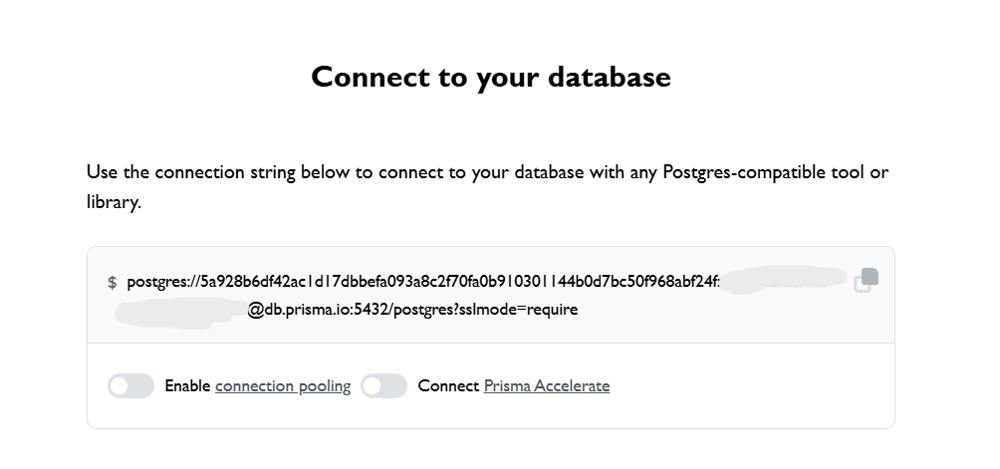

---

## 📊 Log de conexión exitosa de Spring Boot

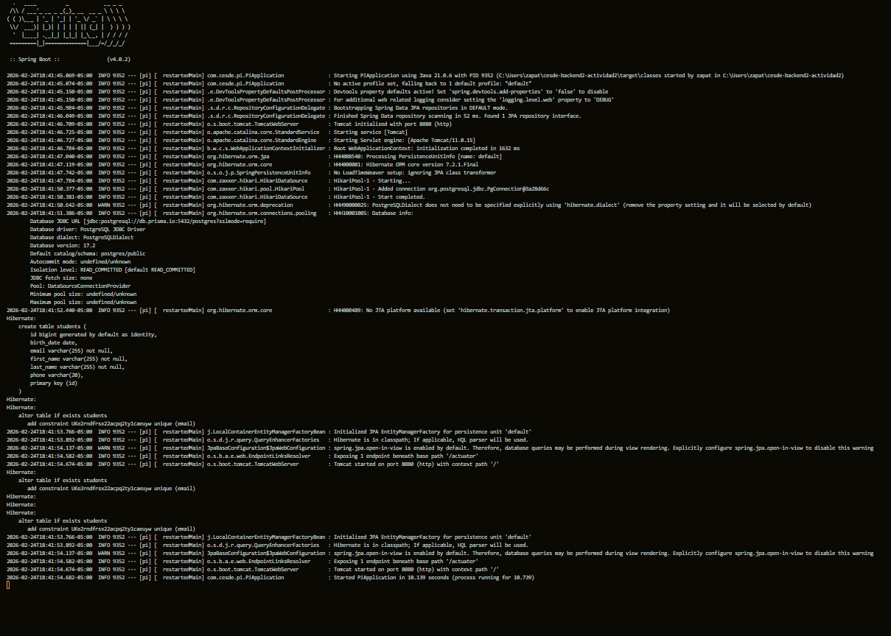

---

## 📝 Notas adicionales
- Las contraseñas y datos sensibles han sido ocultados en las capturas por seguridad.
- La aplicación corre en `http://localhost:8080`
- Base de datos: PostgreSQL en Prisma.io

## 🚀 Guía de Pruebas y Documentación

### 1. Crear un nuevo estudiante

* **Método:** `POST`
* **URL:** `http://localhost:8080/api/students`
* **Cuerpo de la Petición (JSON):**

```json
{
  "firstName": "Ana",
  "lastName": "García",
  "email": "ana.garcia@estudiante.com",
  "birthDate": "2001-03-12",
  "phone": "3004445566"
}

```

* **Respuesta del Servidor (Completar):**

```json
{
    "firstName": "Ana",
    "lastName": "García",
    "email": "ana.garcia@estudiante.com",
    "birthDate": "2001-03-12",
    "id": 1,
    "phone": "3004445566"
}

{
    "firstName": "Laura",
    "lastName": "Martínez",
    "email": "laura.martinez@estudiante.com",
    "birthDate": "2002-11-03",
    "id": 6,
    "phone": "3023334455"
}

{
    "firstName": "Carlos",
    "lastName": "Rodríguez",
    "email": "carlos.rodriguez@estudiante.com",
    "birthDate": "2000-07-25",
    "id": 5,
    "phone": "3017778899"
}
```

* **Código de Estado (Status Code):** `201`

---

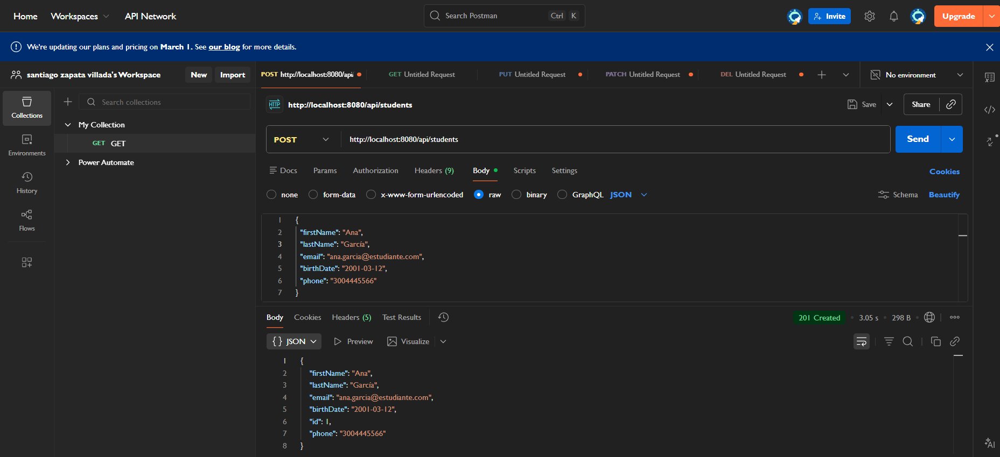

---

---

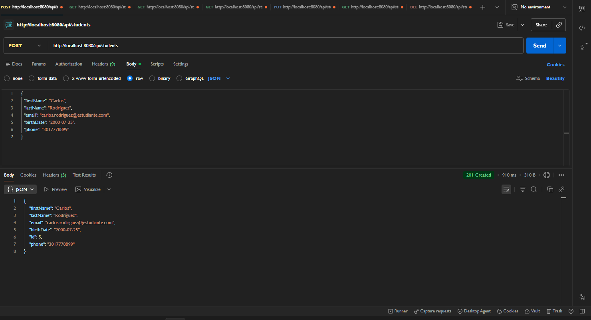

---

---

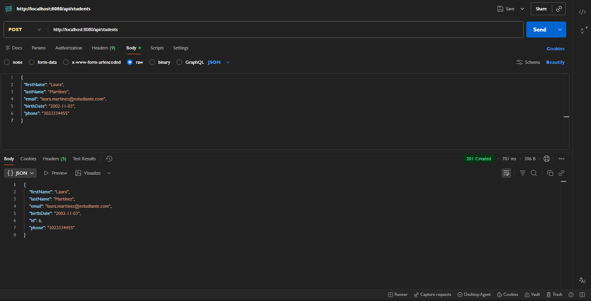

---


### 2. Obtener la lista completa

* **Método:** `GET`
* **URL:** `http://localhost:8080/api/students`
* **Respuesta del Servidor (Completar):**

```json

[
    {
        "firstName": "Cres ",
        "lastName": "MJ",
        "email": "Cris.Mj@estudiante.com",
        "birthDate": "2002-12-12",
        "id": 2,
        "phone": "3004445788"
    },
    {
        "firstName": "Santiago ",
        "lastName": "ZV",
        "email": "SantiagoZV@estudiante.com",
        "birthDate": "2006-08-12",
        "id": 3,
        "phone": "3003917296"
    },
    {
        "firstName": "Ana",
        "lastName": "García",
        "email": "ana.garcia@estudiante.com",
        "birthDate": "2001-03-12",
        "id": 1,
        "phone": "3004445566"
    }
]

```

* **Código de Estado (Status Code):** `200`

---

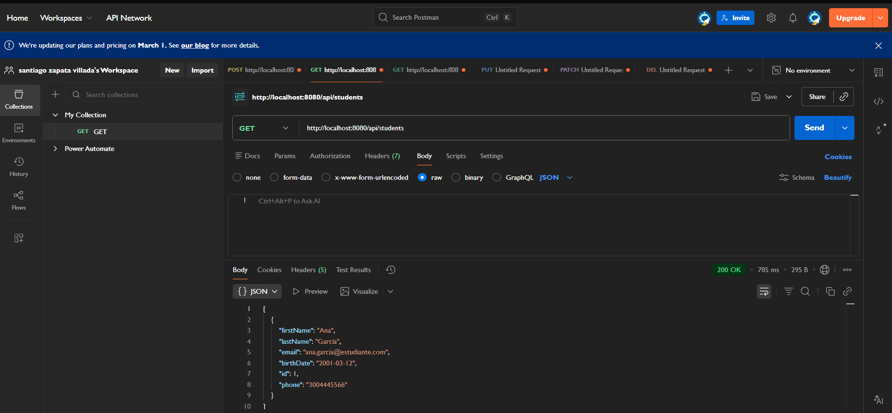

---

### 3. Buscar estudiante por ID (Existente)

* **Método:** `GET`
* **URL:** `http://localhost:8080/api/students/1`
* **Respuesta del Servidor (Completar):**

```json
    {
        "firstName": "Ana",
        "lastName": "García",
        "email": "ana.garcia@estudiante.com",
        "birthDate": "2001-03-12",
        "id": 1,
        "phone": "3004445566"
    }

```

* **Código de Estado (Status Code):** `200`

---

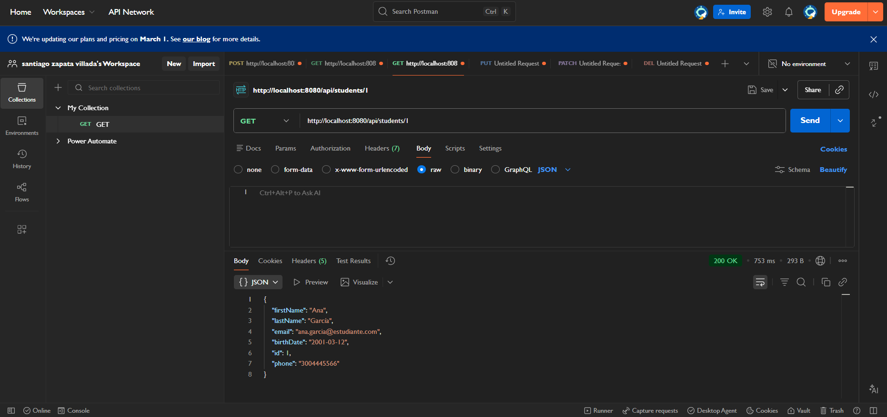

---

### 4. Buscar estudiante por Email

* **Método:** `GET`
* **URL:** `http://localhost:8080/api/students/email/ana.garcia@estudiante.com`
* **Respuesta del Servidor (Completar):**

```json
    {
        "firstName": "Ana",
        "lastName": "García",
        "email": "ana.garcia@estudiante.com",
        "birthDate": "2001-03-12",
        "id": 1,
        "phone": "3004445566"
    }

```

* **Código de Estado (Status Code):** `200`

---

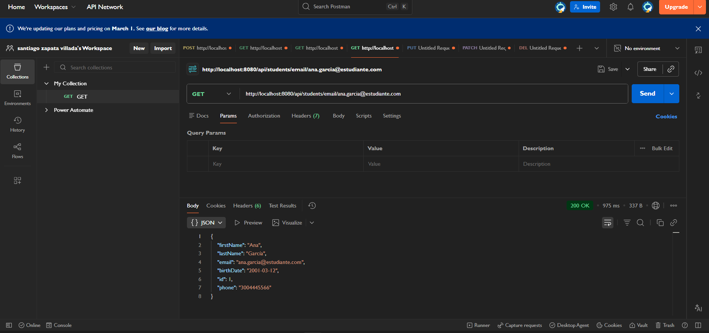

---

### 5. Actualizar datos del estudiante

* **Método:** `PUT`
* **URL:** `http://localhost:8080/api/students/1`
* **Cuerpo de la Petición (JSON):**

```json
{
  "firstName": "Ana María",
  "lastName": "García",
  "email": "ana.garcia@estudiante.com",
  "birthDate": "2001-03-12",
  "phone": "3119998877"
}

```

* **Respuesta del Servidor (Completar):**

```json
{
    "firstName": "Ana María",
    "lastName": "García",
    "email": "ana.garcia@estudiante.com",
    "birthDate": "2001-03-12",
    "id": 1,
    "phone": "3119998877"
}

```

* **Código de Estado (Status Code):** `200`

---

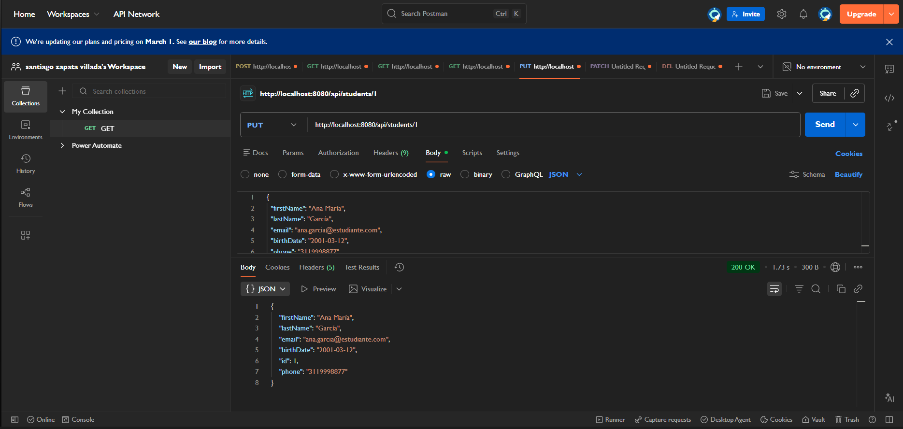

---

### 6. Escenario de Error: Buscar ID inexistente

* **Método:** `GET`
* **URL:** `http://localhost:8080/api/students/999`
* **Respuesta del Servidor (Completar):**

```json
{
  "error": "Not Found",
  "status": 404,
  "message": "Student with id 999 not found"
}

```

* **Código de Estado (Status Code):** `404`

---

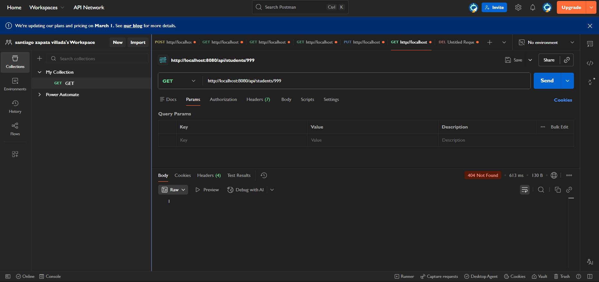

---

### 7. Eliminar el registro

* **Método:** `DELETE`
* **URL:** `http://localhost:8080/api/students/1`
* **Respuesta del Servidor (Completar):**

```json
{
  "message": "Student with id 1 deleted successfully"
}

```

* **Código de Estado (Status Code):** `204`

---

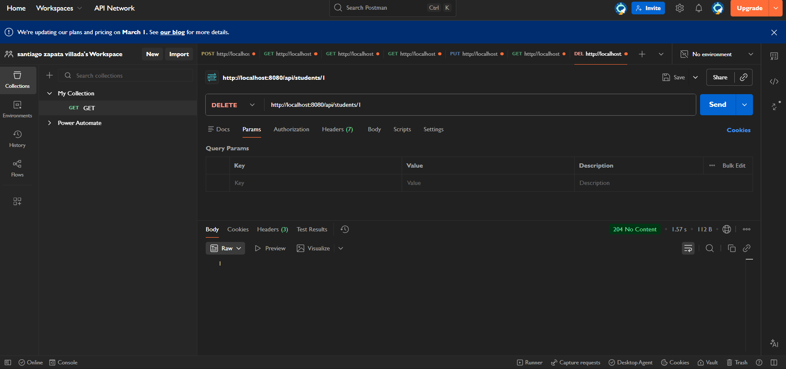

---

## 📝 Cuestionario de Análisis

**Instrucciones:** Responda las siguientes preguntas basándose en su experiencia durante el laboratorio y el código del proyecto.

1. **¿Cuál es la diferencia entre los códigos de estado 200 y 201? ¿En qué endpoints se obtuvieron cada uno?**
* *Respuesta: El 201 se hizo en el Post y el 200 en el Get la diferencia es que el 201 es cuando se crea un objeto y el 200 es cuando se obtiene un objeto*


2. **En el escenario de error (punto 6), ¿qué información devuelve la API y por qué es importante para un desarrollador frontend recibir un código 404 en lugar de un código 500?**
* *Respuesta: La api devuelve un 404 que indica que el error fue de cliente y un mensaje en el cual dice que no existe el estudiante 999  y la importacia de que llegue un 404 a un 500 es que el 404 es especifico y manejable yel 500 es geerico y preocupa*


3. **¿Qué sucede en la base de datos PostgreSQL cuando se ejecuta con éxito la petición DELETE? (Explique brevemente en términos de persistencia).**
* *Respuesta: El registro se elimina permanentemente sin posibilidad de recuperar a menos de que se reinicie la base de datos*


4. **Si intentara crear un estudiante con el mismo email que ya existe en la base de datos, ¿qué cree que sucedería y qué código de error sería el más adecuado para devolver?**
* *Respuesta: sucede que no se puede crear porque ya hay un registro con el mismo email y la tabla debe teer un registro unico asi que tiraria un error 409*


5. **¿Por qué utilizamos el método PUT para actualizar y no el método POST? ¿Cuál es la convención técnica detrás de esta decisión?**
* *Respuesta: Por que el put se usa para modificar un campo en especifico y el post es para crear si usaramos el post creariamos el mismo varias veces y no seria bueno tener registros duplecados *

---

## Ejecución De Pruebas Internas

---


---
